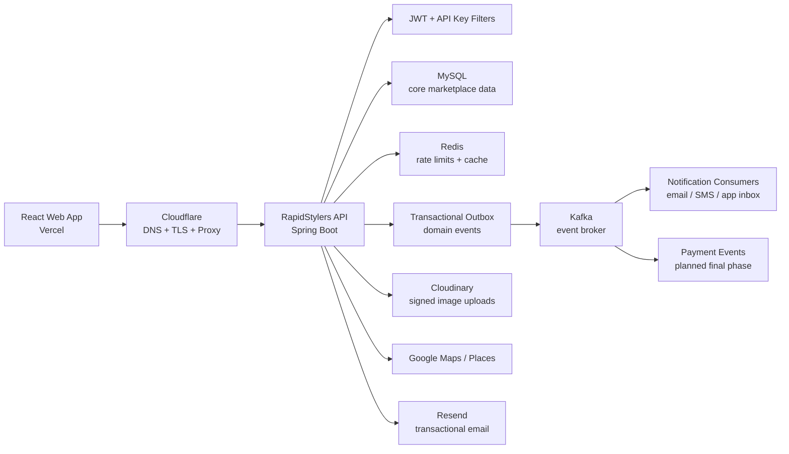
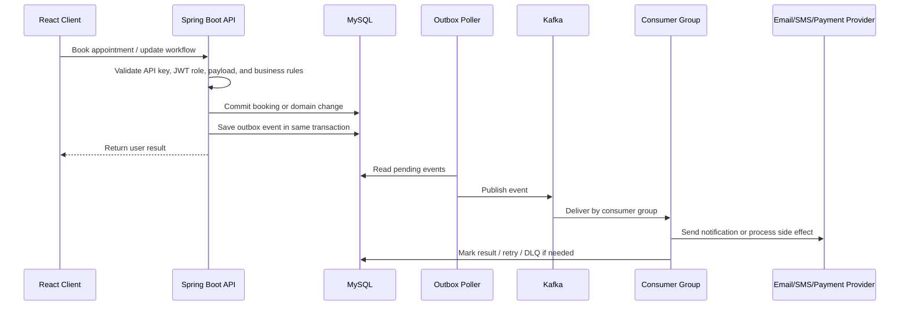

# RapidStylers API Platform

RapidStylers API Platform is the Spring Boot backend behind RapidStylers, a Canadian beauty services marketplace for clients, mobile beauty professionals, and platform admins.

The API owns the business rules that matter most: authentication, stylist onboarding, service setup, appointment booking, travel pricing, notifications, reviews, support tickets, loyalty, media uploads, audit logging, and admin operations. It is being shaped for MVP launch with Redis rate limiting, JWT role protection, Kafka and outbox processing, and Dockerized local infrastructure.

## What This Backend Powers

| Domain | Capability |
| --- | --- |
| Clients | Sign up, sign in, browse stylists, book appointments, save stylists, review services, manage cards, preferences, support, and loyalty. |
| Beauty professionals | Register as stylists, verify email, manage business profile, services, availability, portfolio, appointments, and appointment decisions. |
| Admins | Manage categories, identification records, blog posts, stylist verification, review moderation, support tickets, KPIs, and audit logs. |
| Platform operations | Rate limiting, login audit records, Cloudinary upload signing, geocoding, notifications, and Kafka domain events. |

## Business Summary

RapidStylers is built around trust and convenience:

- Clients should know what they are paying before requesting a booking.
- Stylists should control their base earning for nearby jobs while being compensated for extra travel.
- Notifications, SMS, email, booking, and future payment events should not make the user wait when an outside provider is slow.
- Admins need clear operational controls for verifying stylists, moderating reviews, managing support, and checking platform health.
- The system should be deployable on an MVP ready VPS while leaving room to split workers and services later.

## Recent MVP Changes

| Area | Change |
| --- | --- |
| Booking pricing | Added distance pricing logic: a stylist/vendor base earning covers at least the first 15 km, with an additional distance calculation above that threshold. |
| Event architecture | Added Kafka and transactional outbox direction for notifications, email, SMS, booking events, and future payment side effects. |
| Local infrastructure | Dockerized Redis and Kafka with RapidStylers ports: Redis `6380`, Kafka `9094`, Kafka UI `8089`. |
| Authentication hardening | Added JWT role checks across customer, stylist, and admin workflows. |
| Abuse prevention | Moved rate limiting to Redis and added login attempt audit records. |
| API security | Tightened CORS, fixed preflight handling, protected sensitive role endpoints, and restricted Cloudinary signed upload folders with rate limits. |
| Deployment readiness | Added environment driven configuration for the Cloudflare, Vercel, and VPS deployment shape. |

## System Design



### Transaction And Event Flow



The goal is simple: the booking should not roll back just because an email, SMS, or payment integration has a temporary outage. The core transaction succeeds first; side effects are retried through the event pipeline.

## Architecture Notes

- **Single Spring Boot deployable today.** The HTTP API, outbox publisher, and Kafka consumers currently run in one JVM. Kafka consumer groups make it straightforward to split workers into separate deployables later.
- **MySQL remains the source of truth.** Booking totals, appointment status, users, stylists, services, reviews, loyalty, support, and audit records live in relational tables.
- **Redis is runtime infrastructure.** It supports shared rate limit counters and cache workflows across app instances.
- **Kafka is for side effects and scale.** Notification, email, SMS, booking, and future payment events can be processed asynchronously without blocking the request thread.
- **Cloudinary uploads are signed.** The browser uploads images directly, but signatures are generated by the backend and restricted to approved folder prefixes.
- **Google Maps/Places supports location intelligence.** Address capture and distance workflows feed booking estimates and stylist discovery.

## Project Layout

```text
src/main/java/com/macrotel/rapidstylers/
config/                 filters, constants, Redis, Kafka, and email configuration
controller/             public, auth, admin, Cloudinary, and exception controllers
dto/                    response DTOs used by frontend dashboards
entity/                 JPA entities for marketplace data
outbox/                 transactional outbox event model and publisher
pojo/                   request payload models
repo/                   Spring Data JPA repositories
security/               JWT generation and role based request filtering
service/                business workflows, booking logic, notifications, cache
```

## Stack

- **Java 17**
- **Spring Boot 2.7.12**
- **Spring Web** for REST APIs
- **Spring Data JPA + Hibernate** for persistence
- **MySQL 8 compatible database**
- **Spring Data Redis** for shared counters/cache
- **Spring Kafka** for event streaming
- **JWT** with `jjwt` for tokens that carry role claims
- **Spring Security Crypto** for password hashing support
- **Resend** for transactional email
- **Cloudinary** for signed direct media uploads
- **Google Maps / Places** for address and distance workflows
- **JUnit 5 + Mockito + Spring Boot Test** for regression coverage

## Local Development

Prerequisites:

- Java 17
- Docker Desktop
- MySQL 8 compatible database
- Maven wrapper included in the repo

Start Redis and Kafka:

```bash
docker compose up -d redis kafka kafka-init kafka-ui
```

Copy environment variables:

```bash
cp .env.example .env
```

Run the API:

```bash
./mvnw spring-boot:run
```

The backend defaults to:

```text
API:        http://localhost:9095/rapid_stylers
Redis:      localhost:6380
Kafka:      localhost:9094
Kafka UI:   http://localhost:8089
```

The frontend often points to `http://localhost:9090/rapid_stylers` in local examples. If you run the backend on `9095`, update `REACT_APP_API_BASE_URL` in the frontend `.env`.

## Environment Variables

Use [.env.example](/Users/ayoogunbanwo/software-project/Rapidstylers_Backend/.env.example) as the contract. Important groups:

| Variable group | Purpose |
| --- | --- |
| `DB_*` | MySQL connection. |
| `APP_API_KEY` | Shared API key expected from the frontend. |
| `CORS_ALLOWED_ORIGINS` | Browser origins allowed to call the API. |
| `JWT_SECRET`, `JWT_TTL_MINUTES` | JWT signing and expiry. |
| `ADMIN_EMAIL`, `ADMIN_PASSWORD` | Admin sign in seed credentials. |
| `RESEND_*` | Transactional email. |
| `CLOUDINARY_*` | Signed upload and image deletion workflows. |
| `GOOGLE_API_KEY` | Server side geocoding and Places support. |
| `REDIS_*` | Redis host and local port mapping. |
| `KAFKA_*` | Kafka bootstrap servers, topics, retry, DLQ, and consumer group settings. |

Never commit `.env`, `.env.prod`, real secrets, generated keys, or files that belong only to your machine.

## API Security

RapidStylers uses layered request protection:

1. **CORS allow list** controls which browser origins can call the API.
2. **API key filter** rejects requests without the expected `x-api-key`, except public file serving.
3. **JWT role filter** protects sensitive paths by role: `CUSTOMER`, `STYLER`, or `ADMIN`.
4. **Redis rate limits** protect repeated login, OTP, and upload signature actions across app restarts and multiple instances.
5. **Login attempt audit records** preserve authentication history for later review.
6. **Cloudinary folder allow list** prevents arbitrary signed upload paths.

SQL injection risk is reduced by using Spring Data repositories and queries with bound parameters. Any new native query should continue using named parameters instead of string concatenation.

## Event Topics

```text
rapidstylers.domain-events
rapidstylers.domain-events.retry
rapidstylers.domain-events.dlq
```

Current primary consumer group:

```text
rapidstylers-notification-service
```

Expected expansion:

- `rapidstylers-email-service`
- `rapidstylers-sms-service`
- `rapidstylers-payment-service`
- `rapidstylers-booking-service`

These can start as consumers inside the app and later move into separate containers without changing the frontend contract.

## Docker Services

| Service | Local port | Role |
| --- | ---: | --- |
| `redis` | `6380` | Rate limits and cache. |
| `kafka` | `9094` | Local broker for domain events. |
| `kafka-init` | none | Creates RapidStylers topics. |
| `kafka-ui` | `8089` | Local topic and consumer inspection. |

The ports intentionally avoid the AfroChow stack, which commonly uses Redis `6379`, Kafka `9092`, and Kafka UI `8088`.

## Testing

Run the full backend suite:

```bash
./mvn21 test        # recommended — pinned to a Lombok-compatible JDK (17-21)
./mvnw test         # standard wrapper — requires JAVA_HOME ≤ 21 locally
```

> **JDK note:** Lombok 1.18.30 does not support JDK 22+. On macOS the Homebrew
> `mvn` launches with its own bundled JDK (e.g. 25), which breaks compilation
> with ~200 `cannot find symbol` errors on `@Data` getters. Use `./mvn21`
> (which finds a local JDK 17–21 and delegates to `./mvnw`), or set `JAVA_HOME`
> to a JDK 17–21 yourself. `./mvn21` is the single source of truth for JDK
> selection — CI runs the same script (`ci.yml` → `./mvn21 -B test` on the
> pinned Java 17), and it fails loudly if the JDK ever drifts outside 17–21.

Latest verification (full suite, JDK 21 against local MySQL):

```text
Backend tests: 195 passed
```

Covered areas include booking workflow rules, concurrency/slot protection, notification event handling, outbox publishing, saved stylists, rate limiting, login attempts, CORS/preflight behavior, JWT role protection, and Cloudinary signature guards.

## Production Shape

Target MVP production shape:

```text
rapidstylers.ca       -> Vercel frontend
www.rapidstylers.ca   -> Vercel frontend
api.rapidstylers.ca   -> Spring Boot API on VPS
Cloudflare            -> DNS, TLS, proxy, security layer
VPS Docker network    -> Spring Boot, Redis, Kafka, MySQL
```

Only HTTP(S) should be public. Redis, Kafka, Kafka UI, MySQL, and admin tooling should stay private behind Docker networking, localhost bindings, firewall rules, or SSH tunnels.

## Production Deploy Checklist

Run through these on every deploy so a silent failure can't ship unnoticed.

1. **Build and start the stack**:
   ```bash
   docker compose -f docker-compose.prod.yml up -d --build
   docker compose -f docker-compose.prod.yml ps
   ```
2. **Confirm health is green**: every `rapidstylers-*` container should show `(healthy)`. The API container's healthcheck curls `/actuator/health`; a `DOWN` aggregate returns 503 and marks it unhealthy.
3. **Confirm Redis actually connected — do not skip this.** The app logs one line at startup; grep it in the API logs:
   ```bash
   docker logs rapidstylers-api 2>&1 | grep -i "Redis connected\|Redis connection FAILED"
   ```
   - `Redis connected - host=... port=... auth=... probe=OK (PONG)` → good.
   - `Redis connection FAILED ... Redis-backed features ... will silently fall back to the database` → Redis is configured wrong (host/port/password) or down. The API **starts anyway** and looks fine while geo search, rate limiting, read cache, idempotency, and notification dedup all silently bypass Redis — this is the classic silent degradation. Fix the `REDIS_*` env values and redeploy before you call the deploy done.
   - If this log line is **absent** entirely, you are not running a build that includes the `RedisStartupMonitor`; confirm the image was rebuilt from current source.
4. **Confirm the bootstrap admin seeded**: if `admin_accounts` is empty, the API seeds it from `ADMIN_EMAIL`/`ADMIN_PASSWORD` on boot. A weak/default password is refused (see the `Refusing to seed bootstrap admin` WARN); the admin-account API rejects them too.
5. **Smoke the public surface**: `curl -i https://api.rapidstylers.ca/actuator/health` returns 200/`{"status":"UP"}`, then hit a catalog endpoint (e.g. `/rapid_stylers/list_service`) with the API key and confirm 200.
6. **Check for the silent-fallback signs**: scan the boot log for `Redis connection FAILED` and any `Refusing to seed bootstrap admin` lines before moving on.

## Troubleshooting

| Symptom | First place to check |
| --- | --- |
| Frontend gets CORS errors | Confirm `CORS_ALLOWED_ORIGINS` includes the exact Vercel/local origin. |
| Frontend says unauthorized | Confirm `REACT_APP_API_KEY` matches backend `APP_API_KEY`. |
| Login error is unclear | Check the response body `statusCode`; some business failures return HTTP 200 with application `400`. |
| Upload signature fails | Confirm Cloudinary env values and allowed folder prefix: `profile`, `id`, `store`, or `portfolio`. |
| Vercel shows fallback blog posts | The deployed frontend likely cannot reach this backend or has the wrong API key/base URL. |
| Kafka consumer appears idle | Check `KAFKA_BOOTSTRAP_SERVERS`, topic names, and Kafka UI at `localhost:8089`. |
| Redis rate limits / cache do not share across runs | `docker logs rapidstylers-api 2>&1 | grep -i "Redis connection"`. If you see `Redis connection FAILED`, fix `REDIS_HOST`/`REDIS_PORT`/`REDIS_PASSWORD` and redeploy. |

## Recruiter Notes

This backend demonstrates more than CRUD:

- Marketplace business modeling across clients, stylists, bookings, reviews, support, loyalty, and admin workflows.
- Production minded security: JWT roles, CORS allow listing, API key gating, Redis rate limits, login auditing, and safer media upload signing.
- Event based architecture using Kafka and a transactional outbox pattern.
- Practical infrastructure design for an MVP: Dockerized Redis and Kafka, MySQL persistence, deployment awareness across Vercel, Cloudflare, and VPS hosting, and port isolation from another local platform.
- Clear path to scale: side effect workers can be split from the API later without changing the core domain contracts.

## Contact

Ibikunle Ogunbanwo

`ibikunleogunbanwo@gmail.com`
