# deploy/ — host & edge configuration templates

Ready-to-copy configs for the production edge of the RapidStylers stack. These
mirror `docs/duplication-guide.md` §3 and are **templates**: substitute your
domain, verify with `nginx -t`, and never treat them as the live state on a host.## Where these files sit in the system design

The app-side architecture (layered request gates, Redis runtime state, Kafka
outbox) lives in `docs/architecture.md`; this folder is the **edge of that same
design** — the only part that touches the public internet.

**Full duplication picture** — everything this folder and `scripts/bootstrap-vps.sh` stand up:



_Editable source: `docs/diagrams/duplication-topology.mmd` · re-render with `scripts/render-diagrams.sh`._

Solid lines = request/data path · dashed = control/deploy path (CI ssh, topic setup, env) ·
dotted = the API's outbound-only SaaS calls. `deploy/nginx/` implements the nginx box,
`deploy/cloudflare/` the Cloudflare box, and the Docker network is `docker-compose.prod.yml`.

Two rules from the design keep this folder honest:

1. **nginx sees Cloudflare, never browsers** — so real-IP trust (and the app's
   `RATE_LIMIT_TRUSTED_PROXIES`) is what makes per-user rate limiting work.
2. **The VPS publishes nothing but the API port on loopback** — MySQL, Redis, and
   Kafka never appear here or in DNS; they exist only inside the Docker network.

## Layout

```text
deploy/
├── README.md                     ← this file
├── nginx/
│   ├── sites-available/api.YOURDOMAIN.com.conf   TLS site: api.<domain> → 127.0.0.1:9095
│   ├── cloudflare-real-ip.conf                    trust CF ranges, real client IP
│   └── README.md                                  install + verify steps
└── cloudflare/
    ├── DNS-records.md            records for api / apex / www (Vercel + VPS)
    └── origin-cert.md            Cloudflare Origin CA cert creation + install
```

## Order of operations on a fresh VPS

1. **`scripts/bootstrap-vps.sh`** — installs Docker + nginx, deploy user,
   firewall, syncs the repo, starts the compose stack (`docs/duplication-guide.md` §3).
2. **Cloudflare** — add DNS records (`cloudflare/DNS-records.md`); create the
   Origin CA cert (`cloudflare/origin-cert.md`).
3. **nginx** — install the site template + real-IP snippet (`nginx/README.md`),
   `nginx -t`, reload.
4. **Verify** — `/actuator/health` over https, catalog endpoint with the API
   key, and a fresh-IP rate-limit sanity check (the real-IP snippet is working
   when a throttled curl shows your client IP, not a Cloudflare edge IP).

## Ownership boundary

The Docker network (MySQL/Redis/Kafka/API) is the app's; nginx, certs, ufw, and
DNS are the host's. Keep changes to the former in this repo's compose files and
env contract; document host-level changes here so a duplicate can rebuild them
from scratch.
