# RapidStylers — CI/CD Architecture

_How tested code becomes the running API on the VPS. Implementation: `.github/workflows/ci.yml` +
`.github/dependabot.yml`. Companion docs: `docs/architecture.md` §8.4 (deploy pipeline),
`docs/duplication-guide.md` §4 (replicating it), `deploy/` (what the deploy job ships to)._

## 1. Role in the system design

```
developer → GitHub (dev) ──► CI: tests + gitleaks          → merge to main
                              └──► main push ──► deploy job ──► VPS (rsync → compose → health)
                                                                        │
                                        Vercel (frontend, own pipeline) ◄┘ separate track
```

Three properties make CI a load-bearing part of the architecture, not a formality:

1. **Every CI run is a greenfield database.** The tests job boots a fresh MySQL 8 container
   each run, so Flyway always migrates V1–V12 from an **empty** schema — this is what caught the
   V12 fresh-DB failure. Local runs against the dev database cover the *legacy* schema path, so
   the two schema lineages (fresh + legacy) stay in parity by construction. Keep both running —
   they are the safety net for any future migration (Spring Boot 3, schema consolidation).
2. **Redis and Kafka are deliberately absent from CI.** The suite then proves the API boots and
   auth/OTP/catalog flows work in the *degraded* state (in-memory rate-limit fallback, direct
   reads). If the fail-closed paths rot, CI catches it — which is exactly what should be tested.
3. **Deploy is gated on tests + a full-history secret scan.** The only route to the VPS runs the
   tested, scanned commit; gitleaks has already caught a leaked Google key and an admin-password
   fragment in this repo's history.

## 2. Pipeline at a glance



_Editable source: `docs/diagrams/ci-cd-pipeline.mmd` · re-render with `scripts/render-diagrams.sh`._

| Job | Runs when | Fails on |
|---|---|---|
| **Backend tests** | push / PR to `dev` or `main` | compile, unit/integration failures (368+ tests) |
| **Secret scan** | same triggers | any commit in pushed history containing a secret |
| **Deploy to VPS** | push to `main` only, after tests + scan pass | rsync/SSH error, build failure, API not healthy in 5 min |

Concurrency: one run per branch/ref, newest cancels the in-flight one (`concurrency.group` +
`cancel-in-progress`) — no queued stale builds burn minutes.

## 3. Job deep-dive

### Backend tests
- Ubuntu runner with a `mysql:8.0` service container (root/root, `rapid_stylers` DB, health-gated).
- `actions/checkout@v5` → `actions/setup-java@v4` (Temurin 17, Maven cache) → `./mvn21 -B test`
  with `DB_URL=jdbc:mysql://127.0.0.1:3306/rapid_stylers`.
- `./mvn21` is the **single source of truth for JDK selection** (local and CI): it validates the
  JDK is 17–21 (Lombok-compatible) and fails loudly otherwise, then delegates to `./mvnw`. CI and
  laptops can never drift apart on toolchain.

### Secret scan
- `gitleaks/gitleaks-action@v2` with `fetch-depth: 0` — scans the whole pushed history, so a
  secret committed earlier on a branch still blocks the merge.
- Separate job from tests and a hard dependency of deploy: a leak never rides to the VPS.

### Deploy to VPS (`main` only)
1. SSH key from `secrets.VPS_SSH_KEY` installed to a 600-perm temp file.
2. `rsync -az --delete` the tested commit to `rapiddeploy@VPS:/opt/rapidstylers/backend/`,
   excluding `.env`, `.git`, `target`, `.github` — the host `.env` is never touched.
3. `docker compose -f docker-compose.prod.yml up -d --build app` over SSH.
4. Poll `curl 127.0.0.1:9095/actuator/health` (30 × 10 s) — the same gate the container
   healthcheck uses.
5. Temp key removed in an `if: always()` step.

## 4. Design decisions (why it looks like this)

| Decision | Reason |
|---|---|
| Deploy only from `main`, never `dev` | `dev` stays the work branch with full CI; `main` is the releasable line. Deploys are boring and identical every time |
| Image built **on the VPS** from the pinned commit | One artifact story (source → jar → container) with no registry to leak keys or go stale; the rsync'd commit *is* the deployment |
| rsync excludes `.env` | The only secrets on the VPS live in the host file; redeploys can't clobber them |
| No Redis/Kafka service containers | Keeps runs ~2 min and hermetic, and the suite doubles as a degradation test (see §1) |
| MySQL as a service container (fresh per run) | Every run replays Flyway from empty — greenfield parity, cheaply |
| gitleaks with full history | Catches secrets retroactively, before code reaches GitHub |
| Tests + scan gate deploy via `needs:` | The pipeline cannot ship a red or leaking commit by accident |
| Health wait instead of blind sleep | Failures are loud (non-zero exit) and bounded (~5 min max) |
| Cancel-in-progress concurrency | Fast feedback; no stale queued runs |
| Actions + deps updated by Dependabot (weekly) | `.github/dependabot.yml` — Maven + GitHub Actions, `dependencies` label; activates on the repo's **default branch** (backend: pending merge of the dev→main PR) |

## 5. Known gaps (honest, planned)

| Gap | Impact | Plan |
|---|---|---|
| No staging environment | Prod deploy has only the health gate, no journey smoke after deploy | Manual post-deploy checklist (`docs/duplication-guide.md` §6) today; staging is a VPS-scale decision, not a code one |
| No instant rollback | Rollback = `git revert` + redeploy of the previous commit | Acceptable at this scale; document the command |
| nginx/edge templates not validated in CI | `deploy/` configs are only checked on the host (`nginx -t`) | Cheap `nginx -t` job in a container — candidate micro-improvement |
| No SAST / dependency-CVE job | gitleaks covers secrets only | Route into the Spring Boot 3 migration phase (#5), where dependency churn is highest |
| Docker build happens on the VPS | Deploy time includes the jar build on the host | Fine today; move to GHCR with cache when builds feel slow |
| Legacy-schema parity depends on local dev-DB runs | CI only replays the fresh path | Keep both in the phase-plan safety net; document runs |

## 6. Replicating this pipeline

Full setup steps live in `docs/duplication-guide.md` §4. The non-obvious parts:

**Secrets** (repo → Settings → Secrets):

```text
VPS_SSH_KEY   # private key whose public half is in the deploy user's authorized_keys
VPS_HOST      # VPS IP / hostname
VPS_USER      # default: rapiddeploy (matches scripts/bootstrap-vps.sh)
```

**Branch protection on `main`:** require the `Backend tests` and `Secret scan (gitleaks)`
status checks and require pull requests — that makes the gates real instead of cosmetic.

**Dependabot go-live:** Dependabot only reads `.github/dependabot.yml` from the **default
branch**. Backend defaults to `main`, so the config ships on the dev→main PR; until it merges,
Dependabot is dormant on the backend (the frontend repo, default `main`, is already live).

## 7. Relationship to the phase plan

CI/CD is the *enforcement layer* of the phased simplification: every phase lands as small
commits on `dev`, rides the green pipeline, and only a merged, green `main` deploys. The two
properties that must never be traded away while simplifying are the **fresh-DB migration
parity** and the **no-Redis/Kafka degradation runs** — both are cheap and both are exactly what
proved the pipeline's worth during the V12 and Redis-fallback fixes.
