# RapidStylers — Duplication Guide (stand up a copy from scratch)

_Companion to [`docs/architecture.md`](./architecture.md), which explains how the system is built.
This guide is the how-to-reproduce-it: local development machine, a fresh VPS, CI/CD, and the
config matrix that trips up most copies. It mirrors the actual files — `docker-compose.yml`,
`docker-compose.prod.yml`, `Dockerfile`, `.github/workflows/ci.yml`, `.env.example`, `README.md`._

---

## 0. What you end up with

| Piece | Where it runs | What it is |
|---|---|---|
| Backend API | your machine (dev) / VPS (prod) | Spring Boot 2.7 jar, Java 17, port **9095** |
| Frontend | Vercel | React SPA, calls `api.…` with `x-api-key` + JWT |
| MySQL 8 | local (dev) / VPS container (prod) | all marketplace data, 27 tables via Flyway V1–V12 + Hibernate |
| Redis 7 | local container `:6380` / VPS container | rate limits, read cache, geo, idempotency, sessions, dedup |
| Kafka | local container `:9094` / VPS container | outbox → domain events → email consumer |
| Cloudflare | edge | DNS + TLS + proxy in front of the VPS |
| nginx | VPS host | TLS termination → `127.0.0.1:9095` |

## 0.1 System design in one picture



_Editable source: `docs/diagrams/system-design.mmd` · re-render with `scripts/render-diagrams.sh`._

The design decisions that shape every install below (full detail: `docs/architecture.md`):

1. **Layered gates on every request** — CORS allowlist → shared `x-api-key` → JWT roles
   (`CUSTOMER/STYLER/ADMIN`) → method-level `@PreAuthorize`. Only three paths are exempt:
   public files, the Stripe webhook, and `/actuator/health`.
2. **MySQL is the source of truth; Redis is runtime state.** Redis holds rate-limit counters,
   idempotency claims, session idle windows, the read cache, the geo index, and notification
   dedup — and every Redis failure degrades gracefully instead of taking the API down.
3. **Kafka exists for the email outbox** — a booking commits to MySQL + the outbox table in one
   transaction; a poller publishes to Kafka; a consumer sends the email with retry/DLQ. Nothing
   else consumes those events today.
4. **Single-host by design.** Everything runs on one VPS behind one nginx. The compose files in
   this repo ARE the deployment — no orchestrator, no service mesh.
5. **Auth is hardened but stateless.** 15-min access JWTs + rotating 7-day refresh tokens
   (family burn on replay, per-role idle windows in Redis). No server-side sessions to scale.

> **Optional in dev:** Redis and Kafka can be absent — the API boots anyway and degrades
> gracefully (rate limiting falls back in-memory, Kafka consumers disabled in tests). MySQL is
> the only hard requirement.

---

## 1. Repos & accounts

**Repos** (fork/push if you're duplicating into a new org):

- Backend: `Ibikunleogunbanwo/Rapidstylers_Backend` (trunk = `dev`, release = `main`)
- Frontend: `Ibikunleogunbanwo/Rapidstylers_Frontend` (default branch = `main`)

**External accounts** — create keys before first full run; anything marked *optional* can stay
empty and the app runs degraded:

| Service | What you need | Can stay empty? |
|---|---|---|
| Resend | API key + verified sender (`RESEND_API_KEY`, `RESEND_FROM`) | Emails fail (logged) |
| Cloudinary | Cloud name + API key + secret | Upload/sign flows fail |
| Google Cloud | Places/Geocoding API key; OAuth **Client ID** (public) | Geo + Google sign-in fail |
| Stripe | Test or live keys + webhook + Connect webhook secrets, currency, commission | Payment flows skip (no-payment dev mode) |
| Sentry / BetterStack | DSN / log token + endpoint | Optional, dormant when unset |
| Pexels | Image API key | Optional |

---

## 2. Local development machine

**Prerequisites:** JDK **17–21** (Lombok 1.18.30 breaks on 22+ — always use `./mvn21`), Docker
Desktop, MySQL 8 reachable at `127.0.0.1:3306`, Node 18+ for the frontend.

```bash
# 1. Backend
git clone <backend-repo> && cd Rapidstylers_Backend
cp .env.example .env          # fill real values (never commit .env)

# 2. Infra (Redis :6380, Kafka :9094, Kafka UI :8089) — ports avoid AfroChow's 6379/9092
docker compose up -d redis kafka kafka-init kafka-ui

# 3. MySQL: create the database the .env points at
mysql -u root -p -e "CREATE DATABASE IF NOT EXISTS rapid_stylers;"

# 4. Run the API
./mvn21 spring-boot:run        # API at http://localhost:9095/rapid_stylers
```

**First-boot sanity (2 min):**

```bash
curl http://localhost:9095/actuator/health          # {"status":"UP"}
# boot log should show: Redis connected ... probe=OK (PONG)
# and Flyway "Successfully applied 12 migrations"
```

**Frontend:**

```bash
git clone <frontend-repo> && cd RapidStyler_frontend
npm install
# .env: REACT_APP_API_KEY must equal APP_API_KEY; REACT_APP_API_BASE_URL=http://localhost:9090
npm start
```

**Run tests** (needs MySQL; Redis/Kafka optional — fail-closed paths are exercised in CI the
same way):

```bash
./mvn21 test
```

**Key generation commands** (from `.env.example`):

```bash
openssl rand -hex 64    # JWT_SECRET
openssl rand -hex 32    # ENCRYPT_KEY
```

**Common pitfalls:** JDK 22+ gives ~200 `cannot find symbol` errors → use `./mvn21`;
`ADMIN_PASSWORD` must avoid `$` and `!` (Docker Compose interpolation mangles them); keep
`JWT_TTL_MINUTES=15` (a stale longer value silently lengthens tokens).

---

## 3. Fresh VPS bootstrap (single host, Ubuntu)

This reproduces the **prod compose** — MySQL, Redis, Kafka and the API all on one box, only the
API port published on loopback, nginx in front.

```bash
# 1. Base install
sudo apt update && sudo apt install -y docker.io docker-compose-v2 nginx
sudo systemctl enable --now docker nginx
sudo usermod -aG docker $USER          # re-login so docker works without sudo

# 2. Deploy user + key (used by CI)
sudo useradd -m -s /bin/bash rapiddeploy
sudo mkdir -p /home/rapiddeploy/.ssh && sudo cp ~/.ssh/authorized_keys /home/rapiddeploy/.ssh/
sudo chown -R rapiddeploy:rapiddeploy /home/rapiddeploy/.ssh && sudo chmod 700 /home/rapiddeploy/.ssh

# 3. Firewall: only 22/80/443
sudo ufw allow OpenSSH && sudo ufw allow 80/tcp && sudo ufw allow 443/tcp && sudo ufw enable

# 4. App directory (CI rsyncs here; .env lives only on the host)
sudo mkdir -p /opt/rapidstylers/backend && sudo chown -R $USER /opt/rapidstylers
```

**Copy `.env`** to `/opt/rapidstylers/backend/.env` with **prod values** — see §5 matrix.
The two non-obvious ones:

```dotenv
DB_URL=jdbc:mysql://mysql:3306/rapid_stylers
REDIS_HOST=redis
REDIS_PORT=6379
KAFKA_BOOTSTRAP_SERVERS=kafka:19094
RATE_LIMIT_TRUSTED_PROXIES=127.0.0.1/32,172.18.0.1/32,<Cloudflare ranges — default in compose covers these>
```

**Build & start the stack:**

```bash
cd /opt/rapidstylers/backend
docker compose -f docker-compose.prod.yml up -d --build   # wait ~90s start_period
docker compose -f docker-compose.prod.yml ps              # every container healthy
docker logs rapidstylers-api 2>&1 | grep -i "Redis connected\|Redis connection FAILED"
```

**nginx** — TLS termination onto the loopback API. Ready-to-copy templates live in
`deploy/nginx/` (site config + Cloudflare real-IP snippet) with install steps in
`deploy/nginx/README.md`; Cloudflare side (DNS records, Origin CA cert) is in
`deploy/cloudflare/`. The sketch below is the same shape (Cloudflare Origin CA certs;
adjust paths if you terminate TLS at the edge only):

```nginx
server {
    listen 443 ssl http2;
    server_name api.YOURDOMAIN.com;

    ssl_certificate     /etc/ssl/cloudflare-origin.pem;   # Cloudflare Origin CA or your cert
    ssl_certificate_key /etc/ssl/cloudflare-origin.key;
    ssl_protocols       TLSv1.2 TLSv1.3;

    location / {
        proxy_pass http://127.0.0.1:9095;
        proxy_set_header Host $host;
        proxy_set_header X-Forwarded-For $proxy_add_x_forwarded_for;
        proxy_set_header X-Forwarded-Proto $scheme;
        proxy_read_timeout 60s;
    }
}
```

**DNS:** A record `api.YOURDOMAIN.com → <VPS IP>` on Cloudflare (proxied). The default
`RATE_LIMIT_TRUSTED_PROXIES` already trusts Cloudflare's published ranges, the loopback, and
the Docker bridge, so per-IP rate buckets key off the real client.

**Smoke:**

```bash
curl -i https://api.YOURDOMAIN.com/actuator/health          # 200 {"status":"UP"}
curl -i -H "x-api-key: $APP_API_KEY" https://api.YOURDOMAIN.com/rapid_stylers/list_service
```

**Backups:** the compose volumes (`mysql-data`, `redis-data`, `kafka-data`) are the state.
`docker-compose.prod.yml` keeps MySQL's strict durability defaults (`innodb_flush_log_at_trx_commit=1`)
specifically so whole-volume snapshots restore reliably. Set a nightly `mysqldump` or volume
snapshot cron — outside this repo, per your host.

---

## 4. Wire CI/CD (replicate the pipeline)

Full design and rationale: `docs/ci-cd.md`. Quick summary from `.github/workflows/ci.yml` —
two triggers, three jobs:

| Trigger | Runs | Gate |
|---|---|---|
| push / PR to `dev` | Backend tests (MySQL service container; **no Redis/Kafka**) + gitleaks secret scan | tests + scan green |
| push to `main` | Deploy: tests + gitleaks → rsync → compose rebuild → health wait | green → deploys |

**GitHub secrets to create** on the backend repo:

```text
VPS_SSH_KEY   # private key for the rapiddeploy user
VPS_HOST      # your VPS IP/hostname
VPS_USER      # rapiddeploy (default)
```

The deploy job rsyncs the tested commit to `/opt/rapidstylers/backend/` (excluding `.env`,
`.git`, `target`, `.github`) and runs `docker compose -f docker-compose.prod.yml up -d --build
app`, then polls `/actuator/health` for up to ~5 minutes.

Frontend deploys on Vercel from its `main`; the only cross-repo secret is the shared `x-api-key`.

---

## 5. Config matrix — local vs VPS (the classic duplication trap)

Every env key has two personalities. Copy this table when filling `.env`:

| Key | Local (bare `spring-boot:run`) | VPS (compose) |
|---|---|---|
| `DB_URL` | `jdbc:mysql://127.0.0.1:3306/rapid_stylers` | `jdbc:mysql://mysql:3306/rapid_stylers` |
| `REDIS_HOST` / `REDIS_PORT` | `localhost` / `6380` | `redis` / `6379` |
| `REDIS_PASSWORD` | set if your local Redis needs auth | blank by default (private network) |
| `KAFKA_BOOTSTRAP_SERVERS` | `localhost:9094` | `kafka:19094` |
| `KAFKA_EXTERNAL_ADVERTISED_HOST` | `localhost` | `127.0.0.1` (prod has no external listener) |
| `KAFKA_UI_HOST_PORT` / `REDIS_HOST_PORT` | `8089` / `6380` | not used |
| `RATE_LIMIT_TRUSTED_PROXIES` | empty (key by socket) | loopback + bridge + Cloudflare ranges |
| `SPRING_PROFILES_ACTIVE` | unset | `prod` |

Rules that keep a duplicate healthy:

1. `.env` is gitignored on both repos; `.env.example` is the contract — when you add a key, add it there.
2. `APP_API_KEY` must match the frontend's `REACT_APP_API_KEY` exactly.
3. `CORS_ALLOWED_ORIGINS` must list the exact frontend origin (Vercel domain + localhost in dev).
4. A boot log with `Redis connection FAILED` means the API looks fine while rate limiting, geo,
   cache, idempotency, and dedup silently degrade — fix it before calling a deploy done.

---

## 6. Checklist before you call a copy "done"

- [ ] `/actuator/health` → `UP` locally and on `https://api.…`
- [ ] Boot log: `Redis connected … probe=OK (PONG)` (not `FAILED`)
- [ ] Flyway applied V1–V12 on a **fresh** database
- [ ] Bootstrap admin seeded (weak `ADMIN_PASSWORD` is refused at boot)
- [ ] Catalog endpoint returns 200 with `x-api-key`
- [ ] Booking → Stripe → outbox → Kafka → email path works (payments skip cleanly in no-key dev mode)
- [ ] gitleaks green on push (it catches leaked keys before they reach GitHub)
- [ ] Frontend: correct `REACT_APP_API_BASE_URL` + matching API key; login + one booking journey

---

## 7. If you're cloning this into a new product name

The route prefix `/rapid_stylers` is **embedded in controllers and the security filters**
(`AppConfig`, `JwtAuthFilter` exempt paths), and Kafka topics default to `rapidstylers.*`.
Places to change when re-branding:

- API path prefix `rapid_stylers` (controllers + `AppConfig` exempt-path checks)
- `container_name:` values and compose project name in both compose files
- Kafka topic names (`docker-compose*.yml` `kafka-init` + `.env` `KAFKA_TOPIC_*`)
- CORS origins, README examples, frontend base URL
- Cloudinary folder-prefix allow-list (`cloudinary.allowed-folder-prefixes`)
- Any shared branding in email templates / `RESEND_FROM`

---

_Keep `docs/architecture.md` and this guide together: architecture explains why the system looks
the way it does; this guide is how to stand it up again. Both are inputs to the phased
simplification review — anything this guide tells you to install that the phase reviews cut
should be updated here in the same commit._
